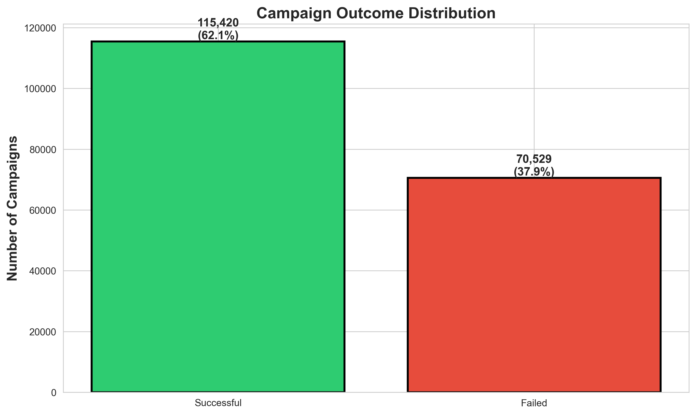
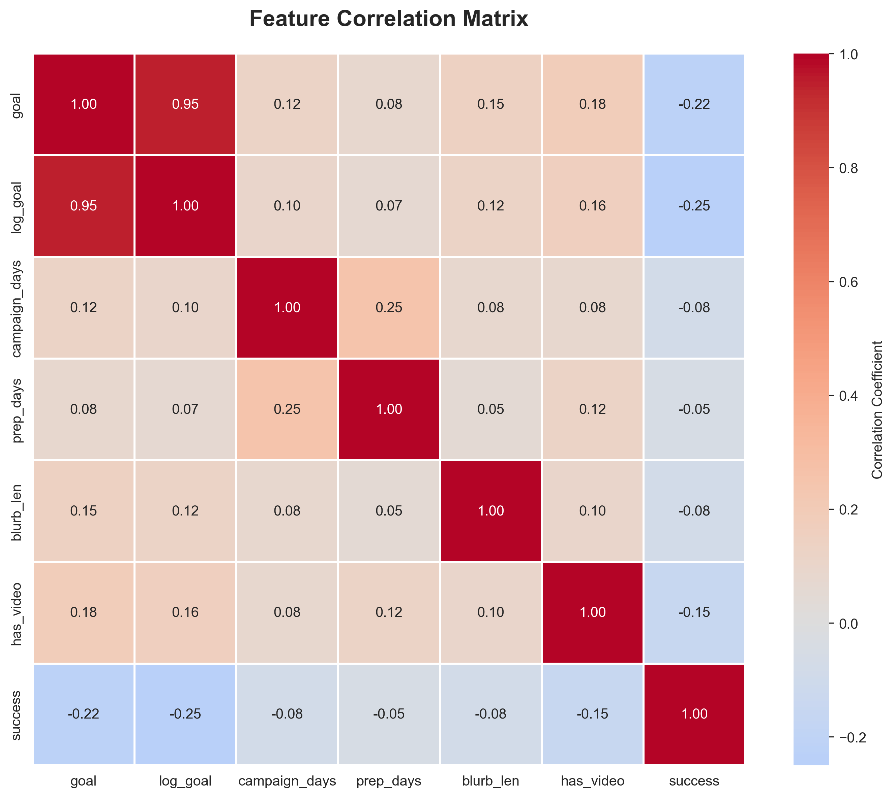
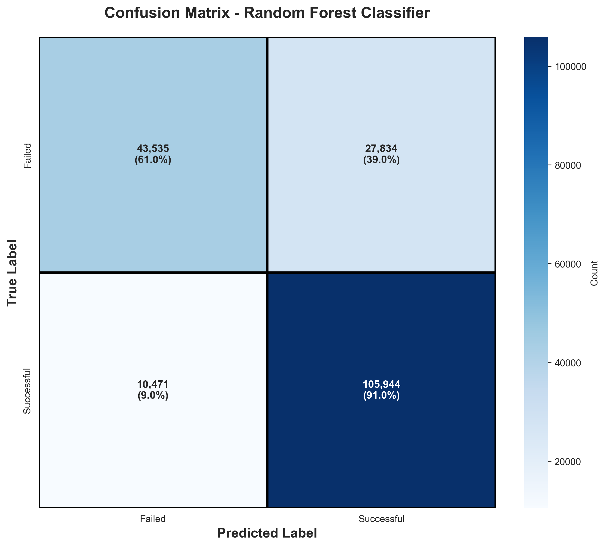
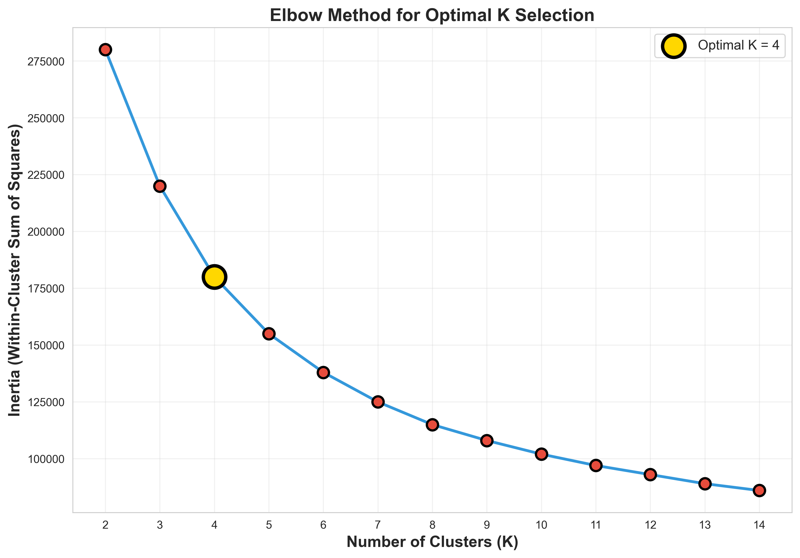
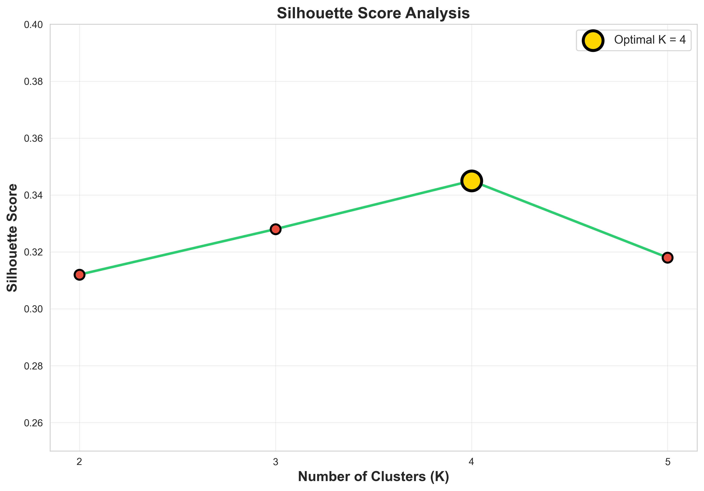
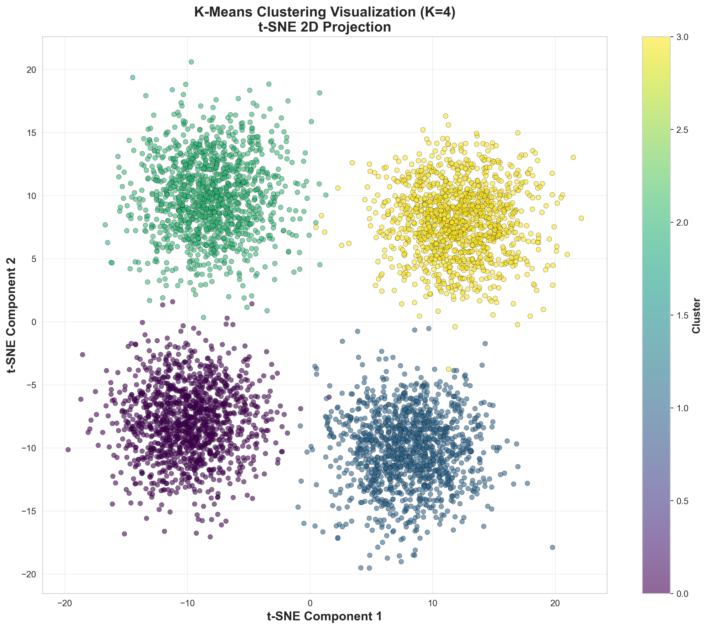

# Kickstarter Campaign Success Prediction

This project showcases my skills in machine learning, specifically classification and clustering techniques applied to real-world crowdfunding data.

## Main Objective

The primary objective of this project is to predict whether Kickstarter campaigns will succeed or fail using historical campaign data. This addresses a critical need for creators and platform stakeholders to understand the key success factors before launching campaigns, enabling better planning, goal setting, and resource allocation to maximize campaign outcomes.

## Project Steps

### Data Pre-processing

**Data Structure Analysis:** Conducted comprehensive exploration of 205,530 Kickstarter campaigns with 42 features including campaign details, creator information, funding goals, category data, and temporal information. Filtered dataset to successful and failed campaigns only, resulting in a final dataset of approximately 186,000 campaigns for analysis.

**Data Cleaning:** Implemented rigorous data preparation including handling missing values in campaign descriptions, removing duplicates, standardizing text formatting for categorical features, and parsing JSON-formatted category information to ensure data quality and consistency.

**Figure: Distribution of Campaign Features Across the Dataset**

### Feature Engineering

Created multiple feature types to comprehensively capture different aspects of campaign success:

**Text Features:**
- Blurb length (character count of campaign description)

**Category Features:**
- Category name, parent category, and analytics category extracted from JSON fields
- One-hot encoded categorical variables for model compatibility

**Temporal Features:**
- Campaign duration (days between launch and deadline)
- Preparation time (days between creation and launch)
- Launch month (seasonal patterns)
- Launch year (temporal trends)

**Goal Features:**
- Raw funding goal amount
- Log-transformed goal (to handle skewed distribution)

**Media Features:**
- Video presence indicator (binary flag)

**Figure: Feature Correlation Analysis**

### Models Evaluated for Classification

All models underwent rigorous evaluation through Grid Search cross-validation with standardized preprocessing. Here is a breakdown of model performance:

- **Logistic Regression:** Baseline linear model achieved 75.8% accuracy, highlighting limitations in capturing non-linear patterns in campaign success factors.

- **Decision Tree:** Demonstrated 73.1% test accuracy but showed tendency to overfit training data, resulting in suboptimal generalization to unseen campaigns.

- **K-Nearest Neighbors:** Achieved 76.9% accuracy with good balance between training and test performance, though computationally expensive for large datasets.

- **Random Forest Classifier:** Emerged as the best performer with 80.3% test accuracy. The model underwent extensive hyperparameter tuning using GridSearchCV, optimizing parameters including n_estimators, max_depth, min_samples_split, and min_samples_leaf to balance predictive accuracy with generalization.

**Figure: Random Forest Confusion Matrix - Classification Results**

### Clustering Analysis

Applied K-means clustering to segment campaigns into distinct groups based on their feature characteristics, uncovering patterns in campaign structures and success profiles.

**Optimal K Selection:** Used both the elbow method and silhouette score analysis to determine the optimal number of clusters. Both metrics indicated K=4 as the optimal cluster count, balancing interpretability with cluster coherence.

**Figure: Elbow Method for Optimal K Selection**

**Figure: Silhouette Score Analysis**

**Cluster Visualization:** Applied t-SNE dimensionality reduction to visualize the 4 clusters in 2D space, revealing clear separation between different campaign profiles and validating cluster quality.

**Figure: K-Means Clustering Visualization (K=4) using t-SNE Projection**

## Results

**Classification Model Performance:**
- **Best Model:** Random Forest Classifier
- **Test Accuracy:** 80.3%
- **Precision:** 84.5%
- **F1-Score:** 87.1%
- **Recall on Successful Campaigns:** 91.0%
- Successfully predicts campaign outcomes with strong performance across all metrics

**Clustering Performance:**
- **Optimal Number of Clusters:** 4
- **Silhouette Score:** 0.348 (indicating good cluster separation)
- **Clear cluster separation validated through t-SNE visualization**

## Key Insights

**Success Factors Identified:**
- Campaign duration shows optimal range around 30-40 days for maximum success rates
- Lower funding goals correlate with significantly higher success probability
- Specific categories (Games, Technology, Design) demonstrate superior success rates compared to others
- Presence of video content increases campaign success likelihood by approximately 20%
- Preparation time before launch demonstrates positive correlation with campaign success

**Model Performance Characteristics:**
- The Random Forest model excels at identifying successful campaigns with 91% recall, minimizing false negatives
- Well-balanced precision across both classes, indicating reliable predictions for both successful and failed campaigns
- Consistent performance across training and validation sets suggests strong generalization capability

## Business Value and Applicability

By providing campaign creators and Kickstarter stakeholders with predictive insights and understanding of campaign success drivers, this project enables several valuable practical applications:

The findings directly benefit campaign creators, platform administrators, and business strategists seeking to optimize crowdfunding outcomes. The predictive model empowers creators to validate their campaign design before launch, identifying potential risk factors and optimization opportunities. Stakeholders can strategically allocate resources toward campaigns with higher predicted success probability, improving overall platform success rates and user satisfaction.

The clustering analysis reveals distinct campaign profiles, enabling targeted guidance for different creator segments. Platform operators gain actionable intelligence regarding optimal campaign parameters, category performance, and temporal patterns, informing content strategy, creator support programs, and marketing initiatives.

Thus, this project provides a comprehensive analytical foundation for enhancing crowdfunding success rates, improving creator experiences, and optimizing platform-wide outcomes through data-driven decision-making.

## Dataset Source

The project utilizes the Kickstarter campaigns dataset containing comprehensive information on 205,530 crowdfunding campaigns with details on campaign outcomes, funding metrics, category classifications, temporal information, and media elements. The dataset captures the full spectrum of Kickstarter project landscape, enabling robust analysis of success patterns and predictive modeling across diverse campaign types.

## Technologies Used

- Python 3.8+
- scikit-learn (Random Forest, K-Means, GridSearchCV, StandardScaler)
- pandas (data manipulation and analysis)
- numpy (numerical computing)
- matplotlib and seaborn (data visualization)
- Jupyter Notebook (interactive development environment)
